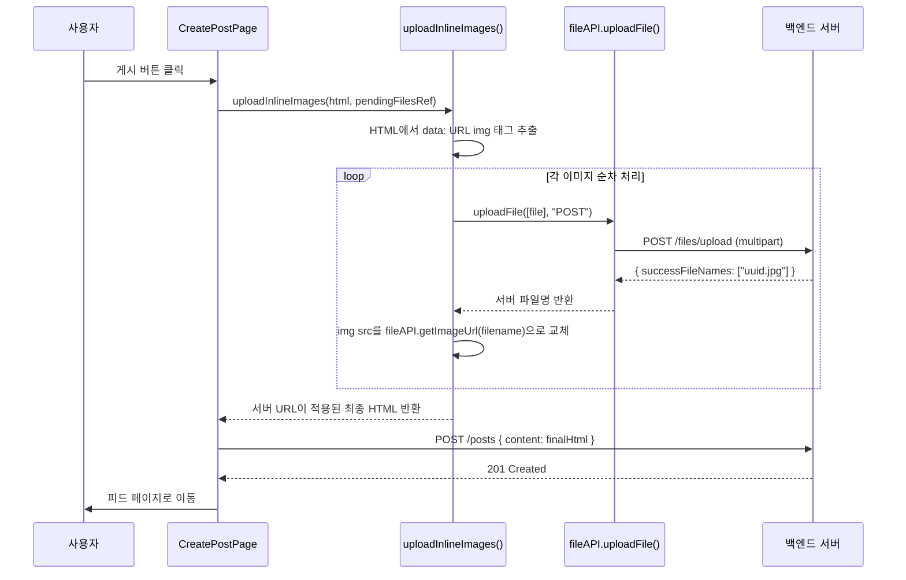

# TiptapEditor — 설계·구현·의사결정 가이드

> **작성 목적**: 커뮤니티 피드 게시글 작성에 사용되는 Rich Text 에디터의
> 기술 선택 배경, 구현 세부 사항, 이미지 처리 흐름을 기록하여
> AI(LLM) 보조 개발 및 미래의 나 자신이 빠르게 컨텍스트를 파악할 수 있도록 한다.

---

## 1. 개요 (Why)

커뮤니티 게시글은 단순 텍스트 이상의 **서식 있는 콘텐츠**를 필요로 한다.

**핵심 목표**:

1. 볼드·이탤릭·헤딩·리스트 등 기본 서식을 툴바로 제공한다
2. 코드 블록에 **문법 강조(Syntax Highlighting)** 를 적용한다
3. 이미지를 드래그 앤 드롭, 클립보드 붙여넣기, 파일 선택 세 가지 방식으로 삽입한다
4. 이미지를 **즉시 업로드하지 않고** 게시 시점까지 클라이언트에 보관(지연 업로드)한다
5. HTML 포맷으로 출력하여 백엔드 저장 및 렌더링과 호환성을 유지한다

---

## 2. 아키텍처 결정 (ADR)

### 2-1. 에디터 라이브러리: Tiptap vs Quill vs Slate

| 항목             | Quill          | Slate          | **Tiptap (채택)**                        |
| ---------------- | -------------- | -------------- | ---------------------------------------- |
| 유지보수 활성도  | 낮음 (정체)    | 보통           | **활발 (ProseMirror 기반)**              |
| 확장 생태계      | 제한적         | 직접 구현 필요 | **공식 Extensions 풍부**                 |
| TypeScript 지원  | 부분적         | 완전 지원      | **완전 지원**                            |
| Next.js SSR 호환 | 불안정         | 가능           | **`immediatelyRender: false` 옵션 지원** |
| 코드 하이라이팅  | 별도 통합 필요 | 별도 통합 필요 | **lowlight 공식 Extension 제공**         |

> **결론**: 확장성, TypeScript 지원, Next.js SSR 호환, 활발한 유지보수를 이유로 **Tiptap**을 채택.

---

### 2-2. 이미지 저장 방식: 즉시 업로드 vs 지연 업로드(채택)

**문제**: 이미지를 에디터에 삽입할 때마다 서버에 업로드하면 발생하는 이슈

- 게시글 저장을 취소해도 서버에 고아 파일(orphan file)이 남음
- 불필요한 네트워크 요청으로 UX 저하

| 방식                   | 고아 파일 위험 | 네트워크 요청         | 복잡도 |
| ---------------------- | -------------- | --------------------- | ------ |
| 즉시 업로드            | **있음**       | 삽입 시마다 발생      | 낮음   |
| **지연 업로드 (채택)** | **없음**       | 게시 버튼 클릭 시 1회 | 중간   |

> **결론**: `pendingFilesRef` (`Map<dataUrl, File>`)에 파일을 보관하고,
> 게시 버튼 클릭 시 `uploadInlineImages()`가 일괄 업로드 후 HTML의 `data:` URL을
> 서버 URL로 교체하는 **지연 업로드 패턴**을 채택.

---

### 2-3. 출력 포맷: HTML vs Markdown vs JSON

| 포맷               | 장점                      | 단점                                  |
| ------------------ | ------------------------- | ------------------------------------- |
| **HTML (채택)**    | 백엔드 저장·렌더링 직관적 | XSS 방어 필요 (서버 sanitize)         |
| Markdown           | 사람이 읽기 쉬움          | 복잡한 서식(이미지 위치 등) 표현 한계 |
| JSON (ProseMirror) | 재편집에 완벽             | 백엔드 파싱 복잡, 저장 용량 큼        |

> **결론**: 백엔드 호환성과 단순성을 위해 `editor.getHTML()` 출력의 **HTML 포맷**을 채택.
> XSS 방어는 서버 사이드 sanitize로 처리한다.

---

## 3. 컴포넌트 구조

```
components/
└── TiptapEditor.tsx      ← 에디터 컴포넌트 (단일 파일)

lib/
└── imageUploadUtils.ts   ← uploadInlineImages() : 지연 업로드 유틸

app/
└── create/
    └── page.tsx          ← TiptapEditor 사용 페이지 (게시글 작성)
```

---

## 4. Props API

```ts
interface TiptapEditorProps {
  /** 에디터 초기 HTML 내용 (빈 문자열이면 빈 에디터) */
  content: string;

  /** 내용이 변경될 때마다 호출되는 콜백 — editor.getHTML() 결과 전달 */
  onChange: (html: string) => void;

  /** 에디터가 비어있을 때 표시할 안내 문구 */
  placeholder?: string;

  /**
   * 에디터 내 삽입된 미업로드 이미지 파일 보관소
   * - key:   data: URL (에디터 src에 사용된 값)
   * - value: 원본 File 객체
   * 게시 시점에 부모가 uploadInlineImages()를 호출하여 일괄 업로드
   */
  pendingFilesRef: React.MutableRefObject<Map<string, File>>;
}
```

### 사용 예시

```tsx
// app/create/page.tsx
const pendingFilesRef = useRef<Map<string, File>>(new Map());
const [content, setContent] = useState("");

// 게시 시점 처리
const finalContent = await uploadInlineImages(content, pendingFilesRef.current);

<TiptapEditor
  content={content}
  onChange={setContent}
  placeholder="첫 줄은 # 제목으로 시작하세요"
  pendingFilesRef={pendingFilesRef}
/>;
```

---

## 5. Tiptap Extensions 구성

| Extension           | 설정                                  | 역할                            |
| ------------------- | ------------------------------------- | ------------------------------- |
| `StarterKit`        | heading levels: 1~6, codeBlock: false | 기본 서식 묶음                  |
| `Placeholder`       | placeholder prop 전달                 | 빈 에디터 안내 문구             |
| `Link`              | openOnClick: false, purple 스타일     | 링크 삽입·편집                  |
| `CodeBlockLowlight` | `createLowlight(common)`              | 코드 블록 + 다중 언어 문법 강조 |
| `Image`             | inline: false, allowBase64: true      | 인라인 이미지 (data: URL 허용)  |

> **Note**: `StarterKit`의 기본 `codeBlock`은 비활성화하고 `CodeBlockLowlight`로 대체한다.
> 두 확장을 동시에 활성화하면 충돌이 발생한다.

---

## 6. 툴바 기능 목록

```
[ B ] [ I ] [ S ] | [ H1 ] [ H2 ] [ H3 ] | [ • ] [ 1. ] | [ " ] [ </> ] | [ 🔗 ] [ 🖼 ] | [ ↩ ] [ ↪ ]
```

| 버튼                | 단축 동작                          | Tiptap 명령                         |
| ------------------- | ---------------------------------- | ----------------------------------- |
| **B** Bold          |                                    | `toggleBold()`                      |
| **I** Italic        |                                    | `toggleItalic()`                    |
| **S** Strikethrough |                                    | `toggleStrike()`                    |
| **H1 / H2 / H3**    |                                    | `toggleHeading({ level })`          |
| **•** Bullet List   |                                    | `toggleBulletList()`                |
| **1.** Ordered List |                                    | `toggleOrderedList()`               |
| **"** Blockquote    |                                    | `toggleBlockquote()`                |
| **</>** Code Block  |                                    | `toggleCodeBlock()`                 |
| **🔗** Link         | `window.prompt`로 URL 입력         | `setLink({ href })` / `unsetLink()` |
| **🖼** 이미지       | 숨겨진 `<input file>` click 트리거 | `setImage({ src: dataUrl })`        |
| **↩** Undo          |                                    | `undo()`                            |
| **↪** Redo          |                                    | `redo()`                            |

- 활성 상태 버튼: `bg-purple-600 text-white` (Purple 테마)
- Undo/Redo: `editor.can().undo()` / `editor.can().redo()` 가능 여부로 disabled 처리

---

## 7. 이미지 처리 흐름

### 7-1. 삽입 경로 (3가지)

```mermaid
flowchart TD
    A[사용자] -->|툴바 🖼 클릭| B[숨겨진 input[file] 클릭]
    A -->|이미지 드래그 앤 드롭| C[handleDrop]
    A -->|Ctrl+V 붙여넣기| D[handlePaste]

    B --> E[insertImageFromFile]
    C --> E
    D --> E

    E -->|FileReader.readAsDataURL| F[data: URL 생성]
    F --> G[pendingFilesRef에 파일 보관\n Map<dataUrl, File>]
    F --> H[editor.setImage src=dataUrl\n 에디터 미리보기 표시]
```

### 7-2. 게시 시점 업로드 흐름



---

## 8. 유효성 검사 규칙

게시 버튼 클릭 시 `CreatePostPage`에서 수행하는 검사 (에디터 컴포넌트 외부):

| 규칙      | 조건                         | 에러 메시지                                            |
| --------- | ---------------------------- | ------------------------------------------------------ |
| 내용 필수 | `content.trim()` 이 비어있음 | "내용을 입력해주세요"                                  |
| 제목 필수 | 첫 번째 블록이 `<h1>`이 아님 | "첫 번째 줄은 반드시 제목 1(# 제목)로 시작해야 합니다" |

> **Why H1 필수?**: 게시글 목록(PostCard)에서 `<h1>` 태그를 파싱해 제목으로 표시한다.
> 제목이 없으면 카드 UI가 빈 제목으로 렌더링된다.

---

## 9. 엣지 케이스 및 제약 사항

| 케이스                         | 처리 방식                                          |
| ------------------------------ | -------------------------------------------------- |
| 이미지 크기 10MB 초과          | `toast.error` 알림, 삽입 취소                      |
| 이미지 업로드 실패 (게시 시점) | `throw new Error` → 게시 중단, toast 에러 표시     |
| 동일 파일 재선택               | `e.target.value = ""` 초기화로 재선택 허용         |
| SSR 하이드레이션 불일치        | `immediatelyRender: false` 옵션으로 방지           |
| 링크 URL 입력 취소             | `url === null` 체크 후 아무 동작 없음              |
| 링크 URL 빈 값                 | `unsetLink()` 호출로 링크 제거                     |
| 에디터 미초기화 상태           | `if (!editor) return null` 가드로 null 렌더링 방지 |

---

## 10. 스타일 가이드

| 영역            | Tailwind 클래스                                                         |
| --------------- | ----------------------------------------------------------------------- |
| 툴바 배경       | `bg-purple-50`, `border-2 border-purple-200`, `rounded-2xl`             |
| 활성 버튼       | `bg-purple-600 text-white`                                              |
| 구분선          | `w-px h-8 bg-purple-300`                                                |
| 에디터 컨테이너 | `border-2 border-purple-200 focus-within:border-purple-500 rounded-2xl` |
| 에디터 내부     | `prose prose-sm max-w-none min-h-[200px] p-4 text-gray-700`             |
| 링크            | `text-purple-600 underline hover:text-purple-700`                       |
| 코드 블록       | `bg-gray-900 rounded-lg p-4 font-mono text-sm overflow-x-auto`          |
| 이미지          | `rounded-xl max-w-full my-2 block cursor-pointer`                       |
